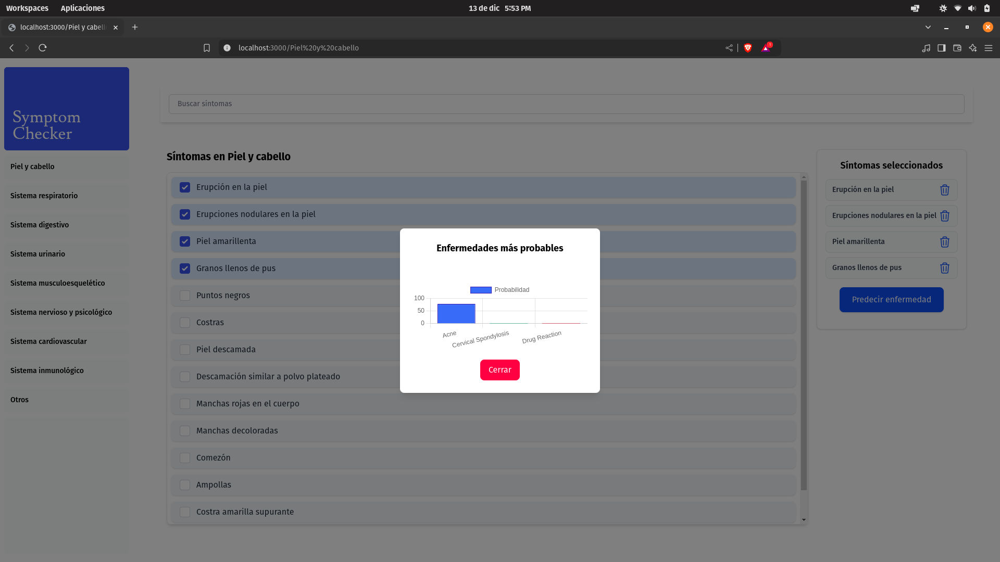

# Symptom Checker



## Description
This project focuses on deploying a machine learning model using XGBoost with a React-based desktop interface. The goal is to practice deploying models in production while focusing on machine learning rather than web development.

## Disclaimer
Please note that the approach used in this project for predicting diseases is not correct and should not be used for any real-world medical applications. This project serves only as an educational example to help me learn about machine learning deployment. A more robust system for disease prediction would require in-depth medical knowledge, clinical data, and statistical analysis to ensure reliability and accuracy. Here, the synthetic dataset DDXPlus could be a great starting point.

## Technologies used
- **XGBoost**: For training the machine learning model
- **React**: For building the front-end interface
- **Python**: For backend and machine learning model deployment

## Steps to run the project
1. Install the Python dependencies:
   ```bash
   pip install -r requirements.txt
   ```
2. Navigate to the `symptom-checker-ui` folder:
   ```bash
   cd symptom-checker-ui
   ```
3. Install the Node.js dependencies:
   ```bash
   npm install
   ```
4. Return to the root folder:
   ```bash
   cd ..
   ```
5. Start the FastAPI backend:
   ```bash
   fastapi dev api.py
   ```
6. In another terminal, start the react app:
   ```bash
   npm run dev
   ```

